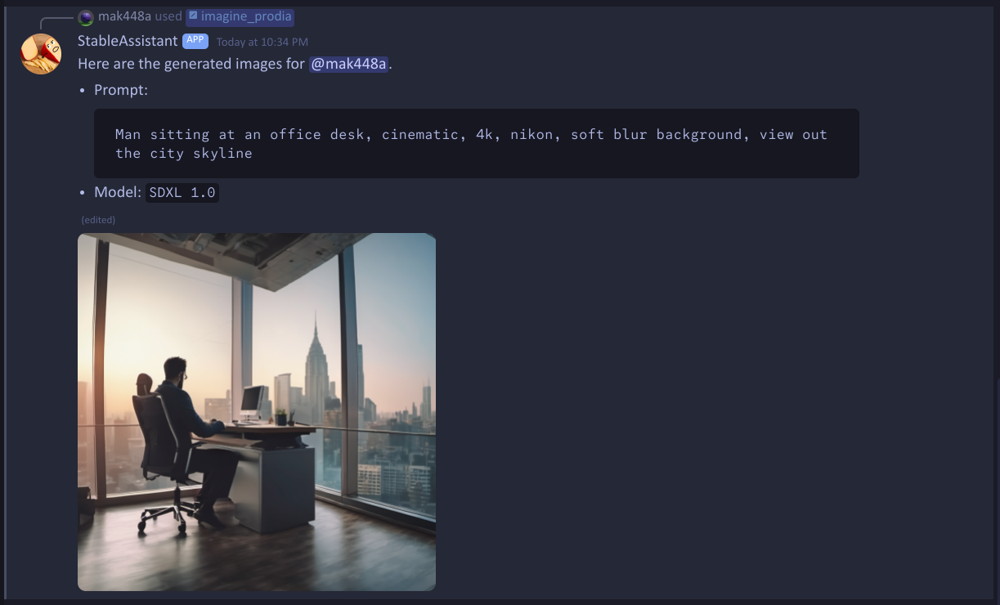

# NOTICE: This is a fork. Get the most up-to-date version here: https://github.com/mak448a/AI-Drawing-Chatbot
# AI Drawing ChatBot


This is a completely free AI image generator Discord bot written in Python.
It has a chatbot that you can ask to draw pictures which uses Llama 3!

This project uses various APIs, which allows it to run on less powerful computers.



## Table of Contents
1. [Features](#Features)
2. [Notes](#Notes)
3. [Prerequisites](#Prerequisites)
4. [Windows Setup](#windows-setup)
5. [Docker Setup](#docker-setup)
6. [Linux/macOS Setup](#linux-and-macos-setup)
7. [Manual Configuration](#Manual-Configuration)
8. [Generate images faster with Stable Horde](#Generate-images-faster-with-Stable-Horde)


## Features
- AI chatbot which is integrated with Stable Diffusion
- 2 slash commands for generating images
- Stable Diffusion
- SDXL Beta
- Pollinations
- Anything Diffusion
- And more!


## Notes

- Llama3 is the recommended model.
- When using SDXL-Beta it sends your generated images to improve the model.
- Do not input any personal information on the `/imagine_poly` command because your generated image will be displayed
on their official frontpage.
- Please do not enter any personal information in the chatbot or in the image generators,
because your prompts are sent to various providers.
- When you use Stable Horde to generate images, your prompts are sent to Stable Horde, as listed in their [privacy policy](https://stablehorde.net/privacy).
- The chatbot will not work as expected if multiple users are chatting with it at once.


## Prerequisites
This project assumes that:
- Python 3.8+ is installed and is on your PATH
- Pip is installed
- Git is installed
- You know how to create a Discord Bot account
- The package python-venv is installed (only for certain Linux distros)


## Windows Setup
1. Create a Discord Bot and grab the token. Make sure to switch on Message Content Intent in the `Bot` tab of the 
[Developer Portal](https://discord.com/developers/applications).
2. Grab an API key from Stable Horde [at their register page](https://stablehorde.net/register).
3. Clone the Stable Horde module: `git clone https://github.com/mak448a/horde_module helper_utils/horde_module --depth=1`
4. Create venv and install dependencies: `python -m venv venv` `venv\Scripts\activate.bat`
`pip install -r requirements.txt`
5. Grab your Groq key from here: `https://console.groq.com/keys`.
6. Run `python run.py` and fill in all the information it asks for.
7. Invite the bot with the link it provides!
8. You can chat with the bot by mentioning it and typing your message.

## Linux and macOS Setup
1. Create a Discord Bot and grab the token. Make sure to switch on Message Content Intent in the `Bot` tab of the 
[Developer Portal](https://discord.com/developers/applications).
2. Grab an API key from Stable Horde [at their register page](https://stablehorde.net/register).
3. Create venv and install dependencies: `python3 -m venv venv && source venv/bin/activate && pip install -r requirements.txt`
4. Clone the Stable Horde module: `git clone https://github.com/mak448a/horde_module helper_utils/horde_module --depth=1`
5. Grab your Groq key from here: `https://console.groq.com/keys`.
6. Run `python3 run.py` and fill in all the information it asks for.
7. Invite the bot with the link it provides!
8. You can chat with the bot by mentioning it and typing your message.

## Docker Setup
1. Make sure you have Docker installed on your machine.
2. Clone this repository to your local machine.
3. Build the Docker image using the following command: `docker build -t ai-drawing-chatbot .`
4. Run the Docker container using the following command: `docker run -it --name chatbot ai-drawing-chatbot`
5. Enter in your token values. Go [here](#linux-and-macos-setup) to find out how to get these.


## Manual Configuration

If you want to manually configure the program for any reason, here are some steps.

<details><summary>Configuring chat model</summary>

Go to `config.json` and set the key `"model"` to the model you want.

**Available Models**
- Llama3

You must write the model exactly as it is written here.

When you are done, the edited line should look like this:

```json
"model": "Llama3",
```

</details>

<details><summary>Disable chatbot</summary>

Go to `config.json` and set the key `"chatbot"` to false.

It should look like this:

```json
"chatbot": false,
```
</details>

<details><summary>Change loading GIF</summary>

Go to `config.json` and set the key `"loading_gif"` to any GIF on Tenor you want!

It should look like this:

```json
"loading_gif": "https://tenor.com/your/favorite/loading/gif",
```
</details>

<details><summary>Turn off command syncing (makes bot load faster)</summary>

Please note that this will break the bot if you haven't run it for the first time.
Go to `config.json` and set the key `"sync"` to `false`.

It should look like this:

```json
"sync": false,
```
</details>

<details><summary>Change chatbot drawing model</summary>

Go to `config.json` and set the key `"image_model"` to a model that you find [here](https://aqualxx.github.io/stable-ui/).

It should look like this:

```json
"image_model": "SDXL 1.0"
```
</details>


## Generate images faster with Stable Horde
Stable Horde uses Kudos to rank users on a queue. The more Kudos you have, the higher you are on the generation queue.
You can get Kudos by rating images and/or generating images for Stable Horde
on your local hardware.
To get more Kudos, first stick your API key [here](https://tinybots.net/artbot/settings).
Then, rate some images generated by other users [here](https://tinybots.net/artbot/rate).
After rating a few images, you should have faster generation times!

**IMPORTANT: When an image says, "This rating must be x," you must rate it that.
This picture is used as a Captcha to avoid spam.**
